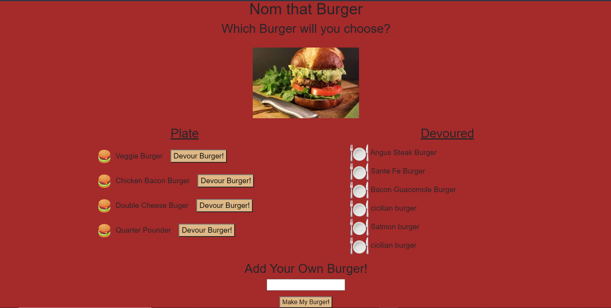

# Nom That Burger

## Description
This is a responsive, Full-Stack Web Application deployed with Heroku that allows the user to type in and save their favorite burgers to a MySQL database. The burgers appear to the left on the screen as soon as they are saved, and a "Devour Now!" Button also appears next to each burger, allowing the user to click and "eat" the burger, moving it to the right side of the screen. Node.js and Express.js are used in the backend of this application to build the server side functionality, and Handlebars.js is used for the template engine.  

## Table of Contents
  - [Installation](#installation)
  - [Deployment](#deployment)
  - [Usage](#usage)
  - [Technologies](#technologies)
  - [License](#license)
  - [Next Steps](#next-steps)
  - [Questions](#questions)

## Installation
There are no special installation instructions required for this application as it is a live, deployed application.

## Deployment
* Deployed App Link: https://nom-that-burger.herokuapp.com/

## Usage
To use this application, simply click on the deployed application link, the click into the text box on the homepage, type in your favorite burger, then click submit to let the fun begin!

## Technologies
* HTML5 
* CSS3 
* Bootstrap 
* JavaScript 
* jQuery 
* Node.js 
* Express.js 
* MySQL 
* Handlebars.js
* Heroku

## License

  [MIT](https://opensource.org/licenses/MIT)
  

  

## Next Steps
* Consolidate code for readablity 
* Write Tests for each js file

## Questions
For additional questions please contact:
* The Privacy Dev
* Email: theprivacydev@protonmail.com
* https://github.com/theprivacydev/
